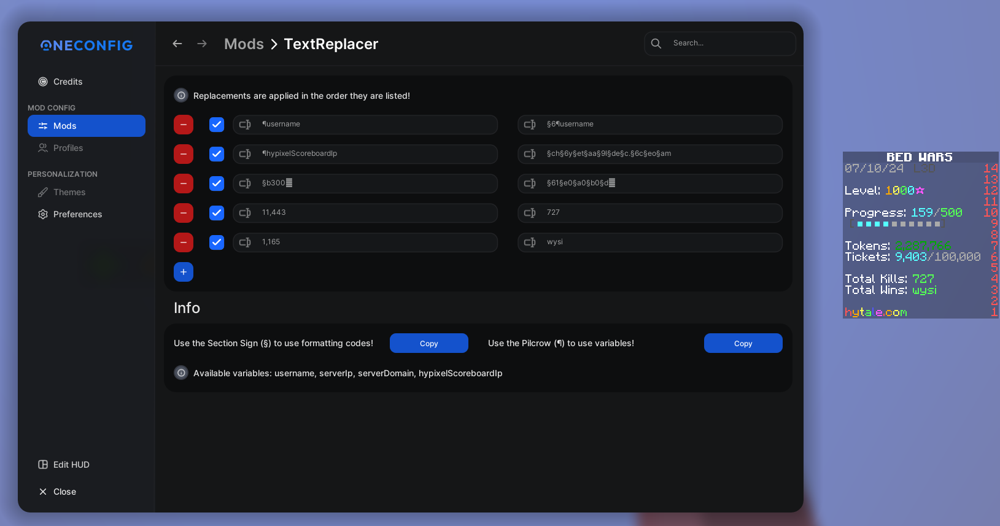

# `TextReplacer`

A Forge 1.8.9 mod using OneConfig to replace any text.

---

Uses the UI from [AutoText](https://github.com/Redths-Gay-Club/AutoText) by [Redth](https://github.com/RedthMC), licensed under the [MIT License](https://raw.githubusercontent.com/Redths-Gay-Club/AutoText/refs/heads/main/LICENSE).

Mod icon was made using [Lucide](https://lucide.dev) icons, licensed under the [ISC License](https://lucide.dev/license).

